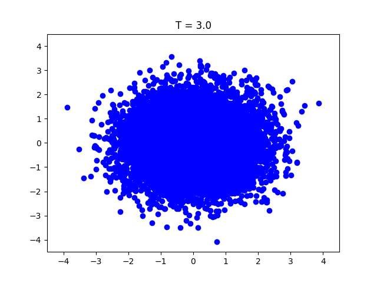
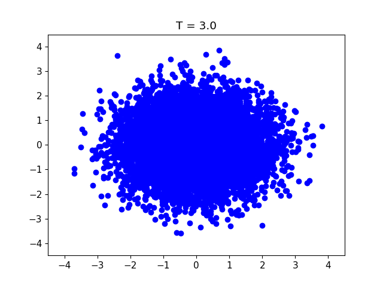
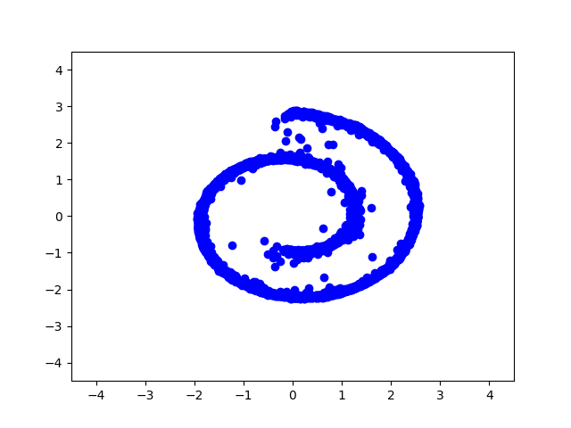
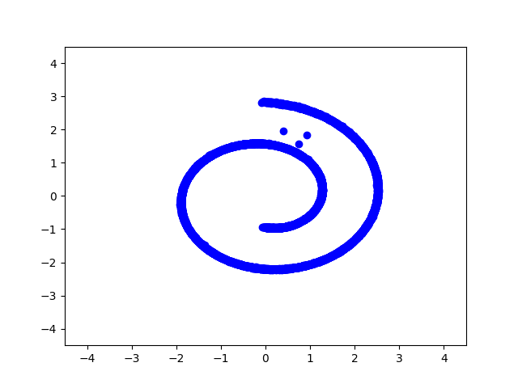
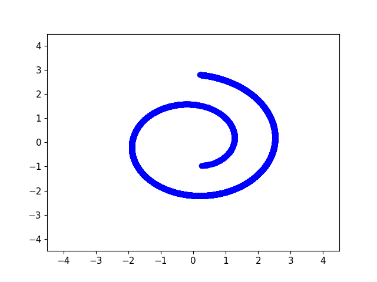
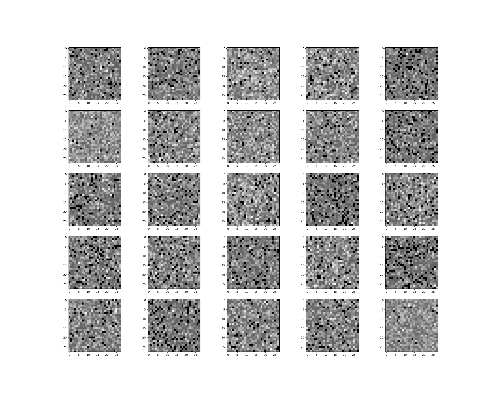
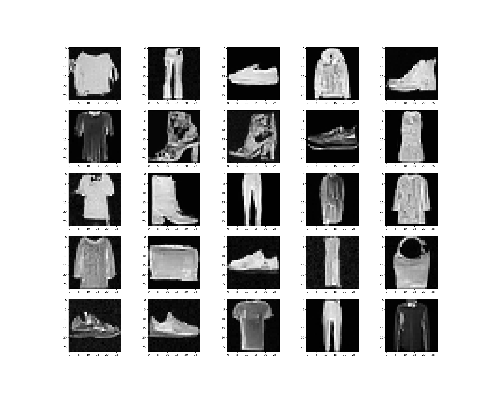
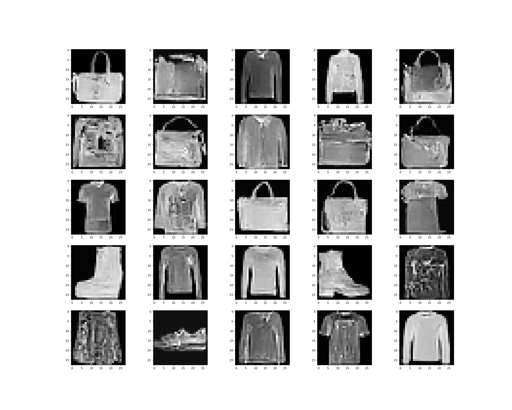
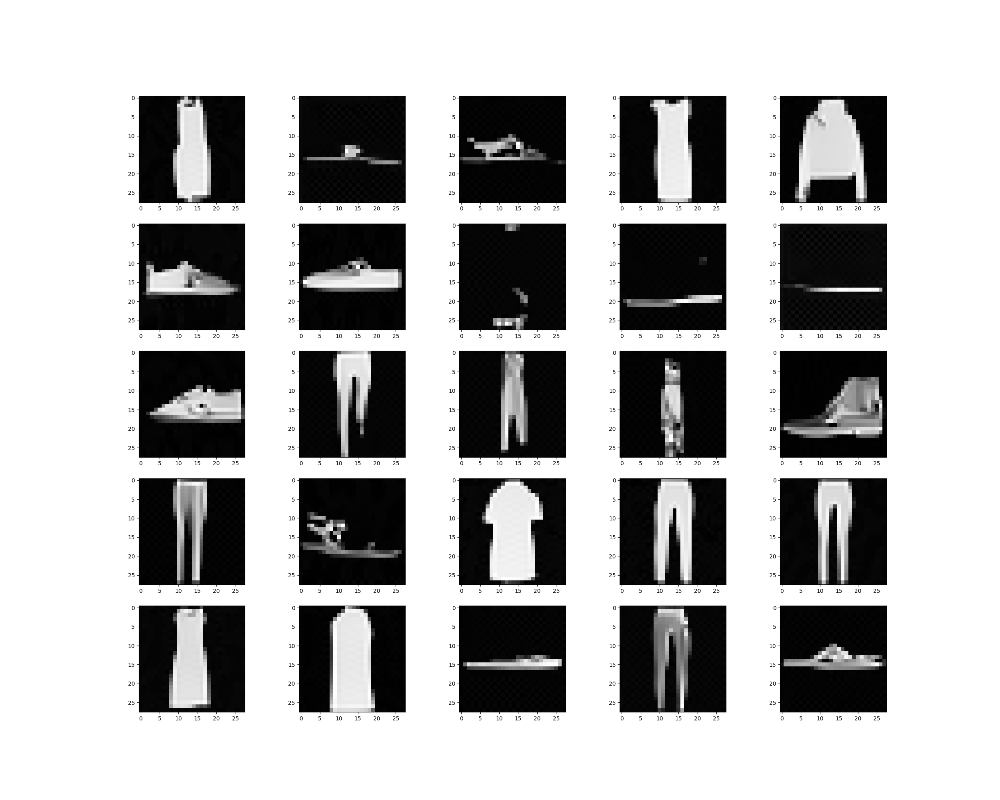

# Image generative models (work in progress)

This repository provides implementations of several generative models applied to image data. These models are primed for understanding and experimenting with advanced image-based generative techniques.

The implemented models are sourced from the following research papers:
- [Score based models](https://arxiv.org/abs/2011.13456) / [Diffusion models](https://arxiv.org/abs/2006.11239)
- [Critically-Damped Langevin Diffusion](https://arxiv.org/abs/2112.07068)
- [Stochastic interpolants](https://arxiv.org/abs/2303.08797)

---

## Table of contents

- [Running the models](#running-the-models)
- [Toy datasets](#toy-datasets)
- [Image datasets](#image-datasets)
- [Audio datasets](#audio-datasets)

---

## Running the models

The configuration files can be found in the `config_files` directory. Use the following command to run a specific model based on the desired configuration:

```bash
python main.py --config_file "config_files/toy/score_toy_config"
```

Examples are provided in the **`notebook/`** directory.

---

## Toy datasets

### Sampling from the models:

| **Diffusion / Score Based Model** | **Critical-damped Langevin** | **Stochastic interpolant** |
|:--------------------------------:|:----------------------------:|:--------------------------:|
|  |  |  |
|  |  |  |

---

## Image datasets

### Sampling from the models for the Fashion MNIST dataset:


| **Diffusion / Score Based Model** | **Critical-damped Langevin** | **Stochastic interpolant** |
|:--------------------------------:|:----------------------------:|:--------------------------:|
|  |  |  |
|  |  |  |

---

## Audio datasets

For audio data, the raw audio signals are first converted into mel spectrograms. These spectrograms are then treated as images, and the generative models are applied to them. The models are trained from the [**audio-diffusion-256**](https://huggingface.co/datasets/teticio/audio-diffusion-256) dataset see also the [original repository](https://github.com/teticio/audio-diffusion).

### Listening to the generated audio:

---

