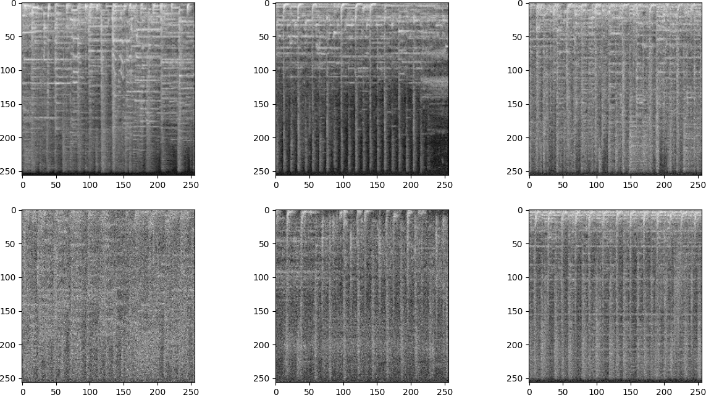
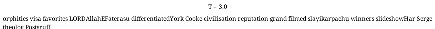

# A unified framework for generative diffusion models (work in progress)

This repository provides implementations of several generative models applied to image data. These models are primed for understanding and experimenting with advanced data generation techniques.

The implemented models are sourced from the following research papers:
- [Score based models](https://arxiv.org/abs/2011.13456) / [Diffusion models](https://arxiv.org/abs/2006.11239)
- [Critically-Damped Langevin Diffusion](https://arxiv.org/abs/2112.07068)
- [Stochastic interpolants](https://arxiv.org/abs/2303.08797)
- [ Discrete Denoising Diffusion Probabilistic Model (D3PM)](https://arxiv.org/abs/2107.03006)
- [Planning with Diffusion for Flexible Behavior Synthesis](https://arxiv.org/abs/2205.09991)

---

## Table of contents

- [Running the models](#running-the-models)
- [Toy datasets](#toy-datasets)
- [Image datasets](#image-datasets)
- [Audio datasets](#audio-datasets)
- [Text datasets](#text-datasets)

---

## Running the models

The configuration files can be found in the `config_files` directory. Use the following command to run a specific model based on the desired configuration:

```bash
python main.py --config_file "config_files/toy/score_toy_config"
```

It is also possible to generate the outputs from a checkpoint using the `main_viz` file

```bash
python main_viz.py -c path/to/checkpoint/last.ckpt -gpu 0 
```

Examples are provided in the **`notebook/`** directory. 

---

## Toy datasets

Experiments of toy datasets for easy and fast experimentation of general diffusion models are given in this section. Both continuous and discrete datasets are considered.

### Continuous datasets:

| **Diffusion / Score Based Model** | **Critical-damped Langevin** | **Stochastic interpolant** |
|:--------------------------------:|:----------------------------:|:--------------------------:|
|  |  |  |
|  |  |  |

### Discrete datasets:


 <div align="center">

| D3PM Uniform | D3PM Absorbing  |
|:--------------------------------:|:----------------------------:|
|  | |
| |  |

</div>


---

## Image datasets

In this section diffusion models are applied to images data. Experiments are made for the three continuous models: Diffusion / Score Based model, Critical-damped Langevin and stochastic interpolant.

### Sampling from the models for the Fashion MNIST dataset:


| **Diffusion / Score Based Model** | **Critical-damped Langevin** | **Stochastic interpolant** |
|:--------------------------------:|:----------------------------:|:--------------------------:|
|  |  |  |
|  |  |  |

---

### Sampling from the models for the CIFAR dataset:


**Note**: The models have not been trained extensively in order to save computational time. However, training them for longer durations should improve the results. See the configuration files from the original papers if needed.

| **Diffusion / Score Based Model** | **Critical-damped Langevin** |  **Stochastic interpolant** |
|:--------------------------------:|:--------------------------:|:--------------------------:|
|  |   |  |
|  |  |  |

---

## Audio datasets

For audio data, the raw audio signals are first converted into mel spectrograms. These spectrograms are then treated as images, and the generative models are applied to them. The models are trained on music samples from the [**audio-diffusion-256**](https://huggingface.co/datasets/teticio/audio-diffusion-256) dataset see also the original [audio-diffusion](https://github.com/teticio/audio-diffusion) repository.

<div align="center">

</div>

Listening to selected audio generated with a diffusion/score based model. Here again the quality of the generated audio can potentially be improved by training for longer duration and allocating more computational resources.


https://github.com/morel-g/generative-models/assets/123385560/ddd2f379-54b2-4c79-84b4-682d2e99f787


https://github.com/morel-g/generative-models/assets/123385560/9662a7f2-19f5-4527-93a8-73fffc8008a0


---

---

## Text datasets


This section focuses on using the Discrete Denoising Diffusion Probabilistic Model (D3PM) architecture to process text datasets. Here the D3PM model is applied to a shortened version (~200k samples) of the [lm1b](https://www.statmt.org/lm-benchmark/) dataset. 

Below are selected visual representations of the model trajectories




---

## Reinforcement learning datasets

In this section, we look at some applications of diffusion models for reinforcement learning. For comprehensive insights refer to the [original paper](https://arxiv.org/abs/2205.09991).

The primary objective here is to enable the model to proficiently navigate through a maze. Here is an example on a simple 2d maze


 <div align="center">
    
 </div>

---