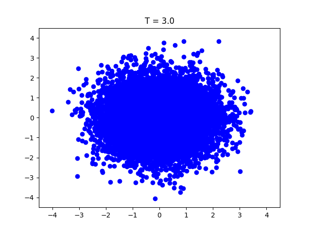
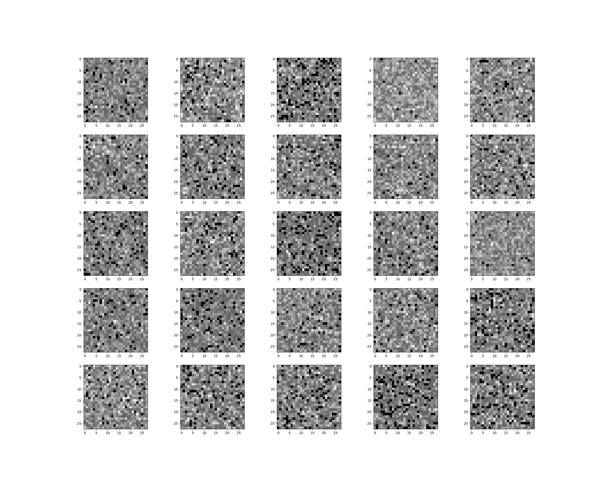
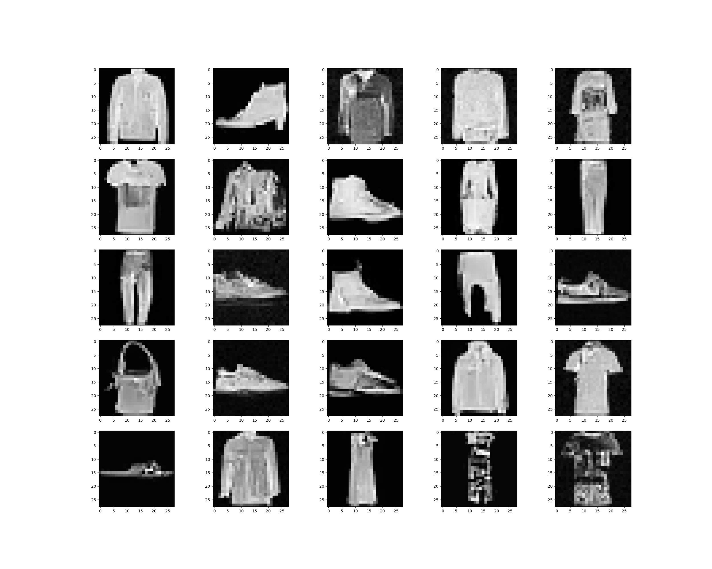

# Image generative models (work in progress)

This repository provides implementations of several generative models applied to image data. These models are primed for understanding and experimenting with advanced image-based generative techniques.

The implemented models are sourced from the following research papers:
- [Score based models](https://arxiv.org/abs/2011.13456) / [Diffusion models](https://arxiv.org/abs/2006.11239)
- [Critically-Damped Langevin Diffusion](https://arxiv.org/abs/2112.07068)
- [Stochastic interpolants](https://arxiv.org/abs/2303.08797)

---

## Table of contents

- [Running the models](#running-the-models)
- [Toy datasets](#toy-datasets)
- [Image datasets](#image-datasets)
- [Audio datasets](#audio-datasets)

---

## Running the models

The configuration files can be found in the `config_files` directory. Use the following command to run a specific model based on the desired configuration:

```bash
python main.py --config_file "config_files/toy/score_toy_config"
```

It is also possible to generate the outputs from a checkpoint using the `main_viz` file

```bash
python main_viz.py -c path/to/checkpoint/last.ckpt -ts 1000 -gpu 0 
```

Examples are provided in the **`notebook/`** directory. 

---

## Toy datasets

### Sampling from the models:

| **Diffusion / Score Based Model** | **Critical-damped Langevin** | **Stochastic interpolant** |
|:--------------------------------:|:----------------------------:|:--------------------------:|
|  |  |  |
|  |  |  |

---

## Image datasets

### Sampling from the models for the Fashion MNIST dataset:


| **Diffusion / Score Based Model** | **Critical-damped Langevin** | **Stochastic interpolant** |
|:--------------------------------:|:----------------------------:|:--------------------------:|
|  |  |  |
|  |  |  |

---

### Sampling from the models for the CIFAR dataset:


**Note**: The models have not been trained extensively in order to save computational time. However, training them for longer durations should improve the results. See the configuration files from the original papers if needed.

| **Diffusion / Score Based Model** | **Critical-damped Langevin** |  **Stochastic interpolant** |
|:--------------------------------:|:--------------------------:|:--------------------------:|
|  |   |  |
|  |  |  |

---

## Audio datasets

For audio data, the raw audio signals are first converted into mel spectrograms. These spectrograms are then treated as images, and the generative models are applied to them. The models are trained on music samples from the [**audio-diffusion-256**](https://huggingface.co/datasets/teticio/audio-diffusion-256) dataset see also the [original repository](https://github.com/teticio/audio-diffusion).

<div align="center">

</div>

Listening to the audio generated with a diffusion / score based model (here again the quality of the generated audio can potentially be improved by increasing the computation time):


https://github.com/morel-g/generative-models/assets/123385560/f5222708-c19f-46ed-8c63-7b90bec3fcd1


https://github.com/morel-g/generative-models/assets/123385560/0222ae71-cf8a-4e59-a83c-86b353f71055


https://github.com/morel-g/generative-models/assets/123385560/ddd2f379-54b2-4c79-84b4-682d2e99f787


---

