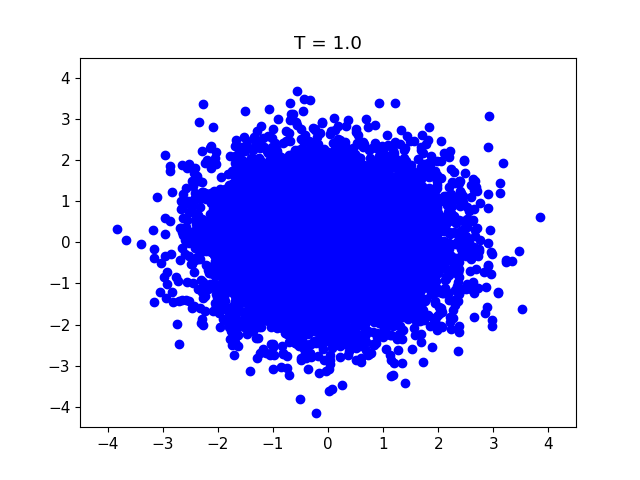
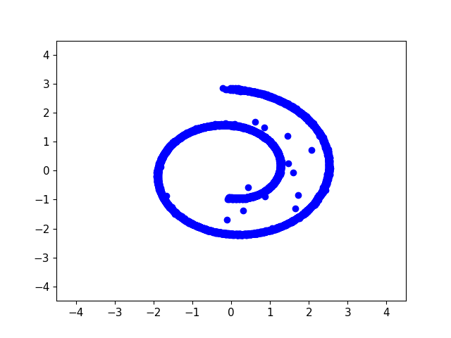
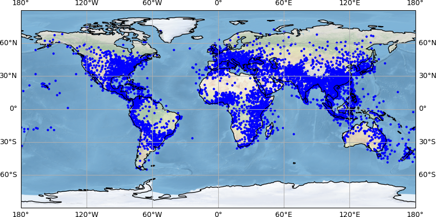
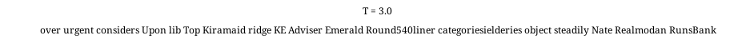
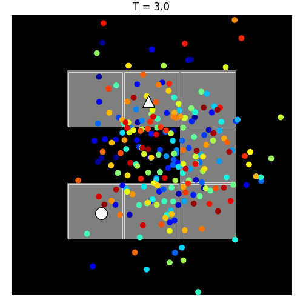
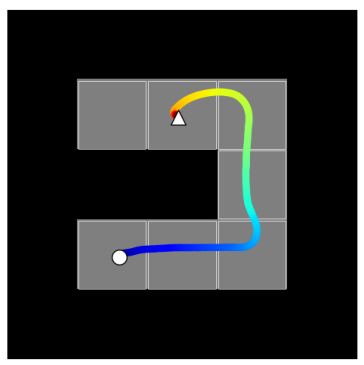
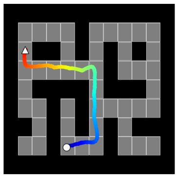

# Unified implementation for various generative diffusion models (work in progress)

This repository provides implementations of several generative models applied to a broad spectrum of data types, including images, text, audio signals, and reinforcement learning scenarios. These models are primed for understanding and experimenting with advanced data generation techniques.

## Implemented models
The implemented models are sourced from the following research papers:
- [Score based models](https://arxiv.org/abs/2011.13456) / [Diffusion models](https://arxiv.org/abs/2006.11239)
- [Critically-Damped Langevin Diffusion](https://arxiv.org/abs/2112.07068)
- [Stochastic interpolants](https://arxiv.org/abs/2303.08797) / [Flow matching](https://arxiv.org/pdf/2210.02747.pdf)
- [Riemannian Flow Matching on General Geometries](https://arxiv.org/abs/2302.03660)
- [ Discrete Denoising Diffusion Probabilistic Model (D3PM)](https://arxiv.org/abs/2107.03006)
- [Planning with Diffusion for Flexible Behavior Synthesis](https://arxiv.org/abs/2205.09991)

---

## Table of contents

- [Running the models](#running-the-models)
- [Toy datasets](#toy-datasets)
- [Image datasets](#image-datasets)
- [Audio datasets](#audio-datasets)
- [Text datasets](#text-datasets)
- [Reinforcement learning datasets](#reinforcement-learning-datasets)

---

## Running the models

The configuration files can be found in the `config_files` directory. Use the following command to run a specific model based on the desired configuration:

```bash
python main.py --config_file "config_files/toy/score_toy_config"
```

It is also possible to generate the outputs from a checkpoint using the `main_viz` file

```bash
python main_viz.py -c path/to/checkpoint/last.ckpt -gpu 0 
```

Examples are provided in the **`notebook/`** directory. 

---

## Toy datasets

Experiments with continuous and discrete toy datasets for general diffusion models.

### Continuous datasets:

| **Diffusion / Score Based Model** | **Critical-damped Langevin** | **Stochastic interpolants / Flow matching** |
|:--------------------------------:|:----------------------------:|:--------------------------:|
|  |  |  |
|  |  |  |

### Discrete datasets:


 <div align="center">

| D3PM Uniform | D3PM Absorbing  |
|:--------------------------------:|:----------------------------:|
|  | |
| |  |

</div>


---

## Image datasets

Applying diffusion models to image data with experiments on Fashion MNIST and CIFAR datasets. Three continuous models are considered: diffusion / score based model, critical-damped Langevin and stochastic interpolants / flow matching.

### Sampling from the models for the Fashion MNIST dataset:


| **Diffusion / Score Based Model** | **Critical-damped Langevin** | **Stochastic interpolants / Flow matching** |
|:--------------------------------:|:----------------------------:|:--------------------------:|
|  |  |  |
|  |  |  |

---

### Sampling from the models for the CIFAR dataset:

**Note**: The models have not been trained extensively in order to save computational time. However, training them for longer durations should improve the results. See the configuration files from the original papers if needed.

| **Diffusion / Score Based Model** | **Critical-damped Langevin** |  **Stochastic interpolants / Flow matching** |
|:--------------------------------:|:--------------------------:|:--------------------------:|
|  |   |  |
|  |  |  |

---

# Manifold datasets

Generative modeling and in particular [flow matching](https://arxiv.org/abs/2302.03660) can be extended to manifold environments. Unlike traditional generative modeling in Euclidean space, this approach offers a more accurate representation for complex, real-world data. It is particularly effective for datasets that naturally reside on these manifolds, offering a more accurate and realistic representation of the data. 

We focus on earthquake, fire, and flood datasets, employing the generative process on a spherical manifold to better reflect the Earth's surface where these phenomena occur. Here all the generative process happens on the sphere.

 <div align="center">


| **Earthquake** |    **Fire**    |    **Flood**    |
|:--------------:|:--------:|:---------:|
|  |  |  |
|  |  |  |

</div>

## Audio datasets

In this section continuous generative models are applied to mel spectrograms of audio signals, trained on music samples from the [**audio-diffusion-256**](https://huggingface.co/datasets/teticio/audio-diffusion-256) dataset see also the original [audio-diffusion](https://github.com/teticio/audio-diffusion) repository.


<div align="center">

</div>

Listening to selected audio generated with a diffusion/score based model. Here again the quality of the generated audio can potentially be improved by training for longer duration and allocating more computational resources.


https://github.com/morel-g/generative-models/assets/123385560/ddd2f379-54b2-4c79-84b4-682d2e99f787


https://github.com/morel-g/generative-models/assets/123385560/9662a7f2-19f5-4527-93a8-73fffc8008a0


---

---

## Text datasets

[Discrete Denoising Diffusion Probabilistic Model (D3PM)](https://arxiv.org/abs/2107.03006) architecture introduces advanced generative models for discrete data, enhancing image and text generation by employing diverse Markov transition matrices.

Here the D3PM model is applied to a shortened version of the [lm1b](https://www.statmt.org/lm-benchmark/) dataset with uniform transition matrix. Below are selected visual representations of the model trajectories




---

## Reinforcement learning datasets

[Diffusion models for reinforcement learning](https://arxiv.org/abs/2205.09991) is a trajectory-level diffusion probabilistic model that enables effective, flexible trajectory optimization by generating globally coherent plans through iterative denoising, demonstrating significant advantages in long-horizon decision-making and adaptability in various control settings.

Below are examples of some trajectories on 2d mazes examples


 <div align="center">
    
 </div>

<div align="center">
     
 </div>

---